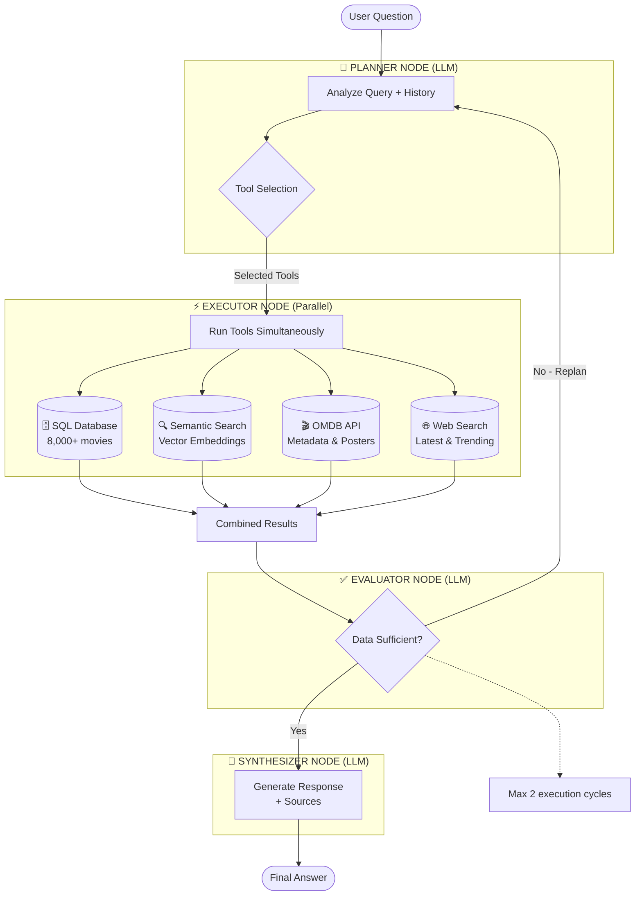

# 🎬 Albert Query - Agentic Movie Intelligence System

> An intelligent conversational agent for querying movie and TV series data using Retrieval Augmented Generation (RAG), agentic workflow orchestration, and semantic search.

[](https://www.python.org/downloads/)
[](https://streamlit.io/)
[](https://www.langchain.com/)
[](https://langchain-ai.github.io/langgraph/)
[](https://www.trychroma.com/)

**Albert Query** is an agentic AI system developed at **Albert School X Mines Paris - PSL**. Unlike traditional chatbots, it orchestrates multiple data sources through an intelligent four-node workflow (Planner → Executor → Evaluator → Synthesizer) with self-correction capabilities, parallel tool execution, and semantic understanding.

---

## ✨ Features

### Core Capabilities

🧠 **Intelligent Query Planning**
Analyzes questions and conversation history to select optimal tools (SQL, Semantic Search, OMDB, Web) with mandatory keyword triggers for deterministic tool selection.

🗄️ **Multi-Database SQL Queries**
8,000+ movies/shows from Netflix, Disney+, Amazon Prime with structured filters (year, genre, rating, type) and automatic schema understanding.

🔍 **Semantic Vector Search**
Find movies by meaning, not keywords—ask for "dark investigation atmosphere" and get relevant thrillers even if those exact words aren't in the database.

🎬 **External API Integration**
OMDB API for posters, cast, directors, plot details, and awards—visual metadata not available in databases.

🌐 **Web Search**
Latest releases and trending movies from current web sources.

🔄 **Self-Correcting Workflow**
Evaluator node can trigger replanning if initial results are insufficient (max 2 execution cycles), ensuring quality responses.

⚡ **Parallel Execution**
All selected tools run simultaneously via asyncio for optimal performance.

📊 **Production Observability**
Full Langfuse integration for tracing, debugging, cost tracking, and performance monitoring.

---

## 🏗️ Architecture

Albert Query implements an agentic RAG system using LangGraph as a state machine with four specialized nodes:



### The Four-Node Workflow

**1. Planner (LLM)** - Analyzes query intent, selects tools via structured outputs (Pydantic), uses keyword triggers (e.g., "poster" → OMDB mandatory)

**2. Executor (Parallel)** - Runs selected tools simultaneously with asyncio, combines results from SQL/Semantic/OMDB/Web

**3. Evaluator (LLM)** - Assesses result sufficiency, triggers replanning if needed (max 2 cycles), prevents incomplete answers

**4. Synthesizer (LLM)** - Generates natural language response with source attribution, maintains conversation context

### Tool Selection Logic

**Mandatory Rules:**
- **Poster/metadata requests** → OMDB (keywords: poster, cast, director, awards)
- **Qualitative searches** → Semantic (keywords: mood, atmosphere, theme, like, similar)
- **Structured queries** → SQL (keywords: how many, count, genre, year, rating)
- **Current events** → Web (keywords: latest, trending, 2026)

**Example:** *"Dark sci-fi from 2020"* → SQL (year filter) + Semantic (dark sci-fi atmosphere)

---

## 🔍 Monitoring with Langfuse

Production-grade observability platform integrated for LLM application tracking.

**Key Capabilities:**
- **Debugging**: See tool selection decisions and planner reasoning
- **Cost Tracking**: Monitor OpenAI API usage per query (~$0.002/query avg)
- **Performance**: Measure latency per node (Planner 1.1s, Executor 2.3s, Synthesizer 0.8s)
- **Quality Assurance**: Identify wrong tool choices, replanning frequency, edge cases

**Setup:**
1. Create free account at [cloud.langfuse.com](https://cloud.langfuse.com)
2. Generate API keys from project settings
3. Add to `.env`:
   ```env
   LANGFUSE_SECRET_KEY="sk-lf-..."
   LANGFUSE_PUBLIC_KEY="pk-lf-..."
   ```

---

## 📁 Project Structure

```
Agentic_Systems_with_RAG_Lamy-Waerniers/
├── code/
│   ├── core/
│   │   ├── agent.py              # LangGraph workflow definition
│   │   ├── models.py             # Pydantic models (ExecutionPlan, State)
│   │   └── state.py              # AgentState schema
│   ├── nodes/
│   │   ├── planner.py            # Tool selection logic
│   │   ├── executor.py           # Parallel tool execution
│   │   ├── evaluator.py          # Result sufficiency check
│   │   └── synthesizer.py        # Response generation
│   ├── tools/
│   │   ├── sql_tool.py           # Multi-database SQL queries
│   │   ├── semantic_tool.py      # ChromaDB vector search
│   │   ├── omdb_tool.py          # OMDB API integration
│   │   └── web_search_tool.py    # Tavily web search
│   ├── prompts/
│   │   ├── planner_prompts.py    # Enhanced with keyword triggers
│   │   ├── evaluator_prompts.py
│   │   └── synthesizer_prompts.py
│   ├── config.py                 # Configuration & API keys
│   ├── utils.py                  # Database catalog builder
│   └── streamlit_app.py          # Streamlit UI
├── data/
│   ├── databases/                # SQLite databases (Netflix, Disney+, Prime)
│   └── vectordb/                 # ChromaDB embeddings (114MB)
├── docs/
│   └── REPOSITORY_AUDIT.md       # Technical debt & cleanup plan
├── .env                          # API keys (not committed)
└── requirements.txt
```

### Architecture Breakdown

**Core Modules:**
- `core/agent.py` - LangGraph StateGraph with conditional edges
- `core/models.py` - Pydantic schemas for structured LLM outputs
- `core/state.py` - TypedDict defining workflow state

**Node Implementations:**
- `nodes/planner.py` - LLM with structured output, keyword-based tool selection
- `nodes/executor.py` - Async tool orchestration, result aggregation
- `nodes/evaluator.py` - LLM-based sufficiency check, replanning trigger
- `nodes/synthesizer.py` - Final response generation with source citation

**Tool Layer:**
- `tools/sql_tool.py` - Multi-DB queries with catalog introspection
- `tools/semantic_tool.py` - ChromaDB similarity search (text-embedding-3-small)
- `tools/omdb_tool.py` - RESTful API client with caching
- `tools/web_search_tool.py` - Tavily integration for current data

---

## 🚀 Future Improvements

### 1. 📦 Catalog Caching System
**Problem:** Database catalog rebuilt on every startup (~2-5s delay)
**Solution:** Cache to JSON with file modification time tracking
**Impact:** 10-50x faster startup, auto-invalidation on schema changes

### 2. 🧠 Persistent Long-Term Memory
**Problem:** Conversations lost on restart (in-memory only)
**Solution:** SQLite-based conversation storage with user preferences
**Features:** Cross-session learning, semantic search over history, personalized recommendations

### 3. 🔐 User Management & API Keys
**Problem:** Single shared API keys, no multi-user support
**Solution:** Streamlit authentication, encrypted per-user key storage, token tracking

### 4. 📈 Embedding Quality Improvements
**Current:** Single-sentence plot descriptions, similarity scores <50%
**Improvement:** Enrich with API data (full plot, cast, themes), better chunking
**Impact:** 10-20% better similarity scores, genre/cast matching

### 5. 🎯 Token Optimization
**Issues:** Verbose prompts (500-800 tokens), full catalog sent to planner (1000+ tokens)
**Strategies:** Prompt compression, catalog summarization, conversation summarization, lazy loading

### 6. 🎨 UI/UX Enhancements
- Results table view toggle, movie cards with posters, query statistics dashboard
- Dark mode, export to JSON/CSV, voice input, multi-language support (French/English)
- Mobile responsiveness, keyboard shortcuts

### 7. 🧪 Testing & Quality Assurance
**Gap:** No automated tests
**Needed:** Unit tests per node, integration tests for workflow, performance benchmarks, regression tests

### 8. 🔒 Security & Privacy
- API key encryption at rest, SQL injection prevention, PII detection/redaction
- Audit logging, rate limiting, HTTPS enforcement, content filtering

### 9. 🚀 Performance & Scalability
- Result caching (Redis), vector index optimization (HNSW tuning), database indexing
- Connection pooling, Docker deployment, CDN for static assets

**Estimated Total Effort:** 40-60 hours for comprehensive implementation

---

## ⚙️ Installation

### Prerequisites
- Python 3.8+
- OpenAI API key
- OMDB API key (free at [omdbapi.com](http://www.omdbapi.com/apikey.aspx))
- Tavily API key (optional, for web search)

### Step 1: Clone & Setup

```bash
git clone https://github.com/Vincent-20-100/Agentic_Systems_with_RAG_Lamy-Waerniers.git
cd Agentic_Systems_with_RAG_Lamy-Waerniers
python -m venv venv
source venv/bin/activate  # Windows: venv\Scripts\activate
pip install -r requirements.txt
```

### Step 2: Configure Environment

Create `.env` file:
```env
OPENAI_API_KEY="your_openai_api_key"
OMDB_API_KEY="your_omdb_api_key"
TAVILY_API_KEY="your_tavily_api_key"
LANGFUSE_SECRET_KEY="sk-lf-..."  # Optional
LANGFUSE_PUBLIC_KEY="pk-lf-..."  # Optional
```

### Step 3: Prepare Data

Ensure database files exist:
- `data/databases/*.db` - SQLite databases (included)
- `data/vectordb/` - ChromaDB embeddings (auto-created or included)

Run embedding creation if needed:
```bash
python code/notebooks/embedding.ipynb
```

### Step 4: Launch

```bash
streamlit run code/streamlit_app.py
```

Access at [http://localhost:8501](http://localhost:8501)

---

## 👥 Contributors

This project was developed as part of our Master's degree at **Albert School X Mines Paris - PSL**.

**Team:**
Vincent Lamy & Alexandre Waerniers

**Institution:**
Albert School X Mines Paris PSL (Paris, France)

---

## 📄 License

This project is licensed under the MIT License - see the LICENSE file for details.

---

<div align="center">

**⭐ If you found this project useful, please consider giving it a star! ⭐**

</div>
